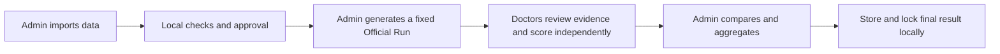

# NTU AI Medical Agent Evaluation Platform

**Review clinical evidence. Evaluate a fixed AI answer. Preserve independent clinician feedback.**

A local research platform with an Epic-inspired Doctor Portal, an Admin Portal, a real SQLite backend, governed dataset preprocessing and configurable model providers. Clinician scores form an auditable reference for future **LLM Jury** research; the platform does not yet train an automated jury.

> Research prototype, not a clinical-care system. This repository is source code you run locally, not a hosted website. Patient databases, credentials and local clinician records are **not included** in a GitHub download.

[中文项目指南](项目指南.md) · [Install & launch](docs/getting-started/README.md) · [Architecture](docs/architecture/README.md) · [Current progress](docs/project/STATUS.md) · [All documentation](docs/README.md)

## Start here

| Your goal | Open this |
| --- | --- |
| Download and try the platform | [Installation guide](docs/getting-started/README.md) |
| Understand the project in Chinese | [中文项目指南](项目指南.md) |
| Understand how the system works | [Architecture & data flow](docs/architecture/README.md) |
| Review completed work and remaining gaps | [Project status](docs/project/STATUS.md) |
| Ask Claude or another developer to review | [Developer handoff](PROJECT_STATUS_FOR_CLAUDE.md) |

## Quick start — Windows

1. Download **Code → Download ZIP** and extract it, or clone this repository.
2. Install **Node.js 24 LTS** and **Python 3.10+**, with both available on PATH.
3. Double-click [First-Time-Setup.cmd](First-Time-Setup.cmd) or [首次安装向导.cmd](首次安装向导.cmd). The wizard installs dependencies, optionally configures a model key, builds, tests and launches the platform.
4. On later visits, double-click [Start-Platform.cmd](Start-Platform.cmd) or [一键启动-AI医疗评估平台.cmd](一键启动-AI医疗评估平台.cmd).

You may skip the model key to explore the interface; generating new AI answers requires your own provider credentials and internet access. Start with synthetic cases. Never send restricted patient data to a provider without appropriate authorization.

Demo Admin: `admin@ntu-demo.local` / `123`. Doctors register on the unified login page. These credentials are for a controlled local demonstration, not a public deployment.

## What it does

| Area | Current capabilities |
| --- | --- |
| **Data processing** | Admin-only intake; ZIP/CSV/CSV.GZ discovery; confirmed mappings; local preprocessing; quality reports; quarantine; versioned approval |
| **Doctor review** | Patient worklist; Epic-inspired chart views; compact longitudinal trends; source records and evidence links |
| **AI generation** | Versioned model registry; OpenAI-compatible providers; fixed Official Runs; blinded model labels; persisted failure/retry/cancellation |
| **Clinician evaluation** | Six fixed scoring dimensions; optional text, preset and custom feedback tags; private drafts and submissions |
| **Admin analysis** | Doctor-first evaluation browsing; aligned clinician comparisons; mean/median/weighted aggregation; auditable final locks |

## Research workflow



Peer Doctors cannot see one another's scores. Finalization requires at least three submitted Doctor evaluations of the **same Official Run**. A replacement answer is a new evaluation batch; old scores are not silently mixed into it.

## Repository map

```text
repository/
├── README.md                     Project home and navigation
├── First-Time-Setup.cmd           First installation (English/Chinese aliases available)
├── Start-Platform.cmd             One-click local launch
├── Stop-Platform.cmd              Stop the verified local instance
├── src/                          FRONTEND — Doctor/Admin/login interface
├── scripts/                      LOCAL BACKEND — API, SQLite, ingestion, registry, launchers
├── worker/                       SHARED MODEL ADAPTER + separate legacy hosting target
├── db/                           Canonical local database schema
├── tests/                        Automated regression and workflow tests
├── samples/                      Small synthetic input examples
├── data-source/                  Bundled synthetic-cohort location (if present)
├── docs/                         Guides, architecture, progress and historical references
├── migrations/                   Legacy hosting-target migrations
├── design-references/            Historical design reference assets
└── output/                       Historical generated reports; not the live database

local only / ignored by Git:
├── .data/                        Patient cases, uploads, scores and encrypted credentials
├── .env.local                    Local provider configuration
├── .runtime/                     Service identity and diagnostic logs
├── node_modules/                 Installed dependencies
└── dist/                         Generated build output
```

The repository root is the project folder: do not create an additional `MVP2` subfolder after cloning. Existing code paths remain stable. Use the directory READMEs to locate the module you need: [frontend](src/README.md), [backend](scripts/README.md), [models/hosting](worker/README.md), [database](db/README.md), [tests](tests/README.md), [samples](samples/README.md).

## Developer commands

Run from the repository root:

```powershell
npm install
npm run build
npm start -- 4190
```

Run verification separately with `npm test`. The Windows launcher selects an available local port if 4190 is occupied. See the [setup guide](docs/getting-started/README.md) for troubleshooting and the [engineering reference](docs/reference/engineering-details.md) for detailed data/model rules.

## Boundaries and next steps

- **Implemented:** local review, model generation, clinician scoring, Admin comparison/aggregation and persistent storage.
- **Not implemented:** real Epic/Conductor/SIMFONI integration, a production multi-hospital deployment, or a trained automatic LLM Jury.
- **Evidence limitation:** validating a source identifier does not prove that a clinical claim is semantically supported.
- **Sharing:** share code and permitted synthetic examples, not `.data/`, restricted patient datasets, clinician exports or API keys.

See [current progress and priorities](docs/project/STATUS.md). Earlier specifications are explicitly labelled in the [documentation index](docs/README.md); they do not override current rules.
