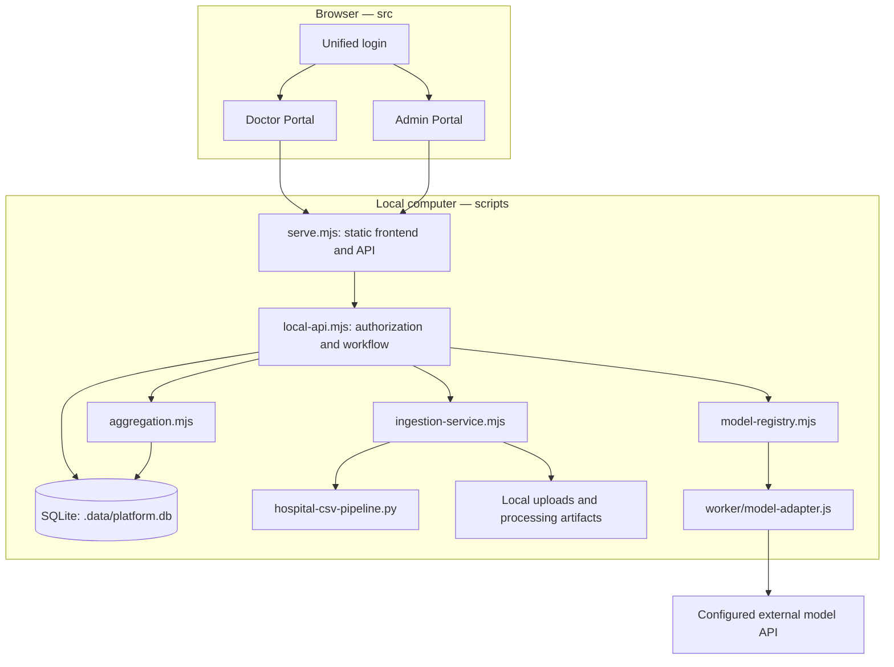

# System architecture / 系统架构

[Project home](../../README.md) · [Documentation](../README.md) · [Current status](../project/STATUS.md)

## Active local runtime

The supported system is a React frontend and a **local Node.js HTTP/API server backed by SQLite**. Python is a local preprocessing subprocess, not an LLM. `worker/model-adapter.js` is shared by the local backend; `worker/index.js` is a separate older hosting target, not the full local Admin/Doctor system.

Preprocessing does not send raw hospital tables to the provider. Model generation is a separate explicit step using an approved case input snapshot. Whether a particular real dataset may be sent externally still requires appropriate institutional and provider authorization.

## Module responsibilities

| Layer | Source of truth | Responsibility |
| --- | --- | --- |
| Frontend | [src/](../../src/README.md) | Role-specific pages, navigation, clinical charts, evidence and scoring UI |
| Local transport | [serve.mjs](../../scripts/serve.mjs), [local-api.mjs](../../scripts/local-api.mjs) | Serve built assets and `/api/v1`; enforce workflow/authorization |
| Persistence/authentication | [database.mjs](../../scripts/database.mjs), [schema.sql](../../db/schema.sql) | SQLite lifecycle, password/session hashing, migrations and audit records |
| Standard import | [dataset-importer.mjs](../../scripts/dataset-importer.mjs) | Standard input validation, case construction, quality issues and quarantine |
| Raw hospital intake | [ingestion-service.mjs](../../scripts/ingestion-service.mjs), [hospital-csv-pipeline.py](../../scripts/hospital-csv-pipeline.py) | Chunked uploads, discovery, confirmed mappings, local preprocessing and approved versions |
| Models/tasks | [model-registry.mjs](../../scripts/model-registry.mjs), [model-adapter.js](../../worker/model-adapter.js), [domain.mjs](../../scripts/domain.mjs) | Versioned configurations, encrypted credentials, task planning and evidence catalogues |
| Scoring/finalization | [aggregation.mjs](../../scripts/aggregation.mjs), [local-api.mjs](../../scripts/local-api.mjs) | Peer-private assessments, same-run comparisons, weights and final locks |
| Operations | [scripts/](../../scripts/README.md) | First installation, verified local start/stop and build packaging |
| Verification | [tests/](../../tests/README.md) | Core workflow, ingestion, installer, hosting compatibility and documentation links |

## Dataset-to-result flow

1. **Import:** Admin uploads standard input or a raw hospital ZIP. Originals, hashes and source positions remain local.
2. **Map and validate:** The raw hospital workflow proposes fields, waits for Admin confirmation, preprocesses locally and produces a report.
3. **Approve:** Admin releases an immutable dataset version. Doctors choose approved shared cases.
4. **Plan the input:** The backend derives the task type and saves a model-input snapshot and reference policy.
5. **Generate:** Admin selects a model configuration. A persisted asynchronous run tracks preparation, model call, response processing, evidence validation and saving.
6. **Score:** Doctors evaluate the fixed Official Run with six dimensions. Their feedback remains private from peer Doctors.
7. **Compare and finalize:** Admin compares only compatible evaluations, selects a recorded aggregation method/weights and locks included submissions.

### Adaptive task policies

| Available history | Task type | Input/reference policy |
| --- | --- | --- |
| One dated meaningful record | `single_visit` | Evaluate the available record; no invented follow-up |
| 2–9 dated records | `short_longitudinal` | Withhold latest record as reference; earlier records form input |
| 10+ dated records | `standard_longitudinal` | Use latest ten; first nine form input, last is reference |
| Undated usable snapshot | `undated_snapshot` | Evaluate as a snapshot; do not infer chronology |

No fixed diagnosis or ten-visit eligibility gate remains. Unresolvable identity or absent meaningful clinical content is quarantined. Unknown units/fields need confirmation; critical clinical values are not fabricated.

## Storage boundaries

| Location | Contains | Included in GitHub? |
| --- | --- | --- |
| `db/schema.sql` | Table definitions, not patient rows | Yes |
| `.data/platform.db` | Local accounts, cases, runs, scores, registry and audit | No |
| `.data/uploads/`, `.data/ingestion/`, `.data/derived/` | Original files and processing artifacts | No |
| `.data/secrets/`, `.env.local` | Local encryption key/provider configuration | No |
| `.runtime/` | Process identity, diagnostics and setup state | No |
| `samples/`, optional `data-source/` | Synthetic examples/cohort files | Only permitted distributable material |
| `dist/`, `node_modules/` | Generated frontend/server package and dependencies | No |

**GitHub is neither the running database nor a patient-data backup.** Changing directory navigation does not migrate or delete the local database.

## Evaluation identity and limitations

- Compare and aggregate an exact Official Run: case, task, dataset version, model configuration, prompt version and output identity must remain compatible.
- A failed/cancelled/interrupted run is not an official answer. Retry creates a new run; replacement archives the previous official answer for its batch key.
- Responses truncated by `finish_reason: "length"` are rejected rather than published as complete answers.
- Finalization requires at least three distinct submitted Doctors for the same Official Run; drafts are excluded.
- Evidence validation resolves allowed identifiers and source paths. It is **not** full semantic fact checking.
- Epic-style UI is a usability choice; no actual Epic, Conductor or SIMFONI connection is implemented.

## Separate hosting compatibility

The legacy [worker entry point](../../worker/index.js), [migrations](../../migrations/0001_p0_core.sql) and [build packager](../../scripts/prepare-sites-build.mjs) are preserved for packaging compatibility. They must not be mistaken for an already deployed, feature-equivalent hosted MVP2. The primary validated workflow remains local Windows + SQLite.
